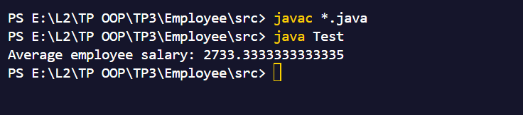

# Employee Salary Calculation Exercise

This Java project consists of classes to handle different types of employees in a business setting and calculate their salaries. The code also includes a method to calculate the average salary of all employees in a business.

## Table of Contents

- [Overview](#overview)
- [Classes](#classes)
    - [Employee](#employee)
    - [FixEmployee](#fixemployee)
    - [EmployeeCommission](#employeecommission)
    - [EmployeeHourly](#employeehourly)
    - [Business](#business)
- [Test Class](#test-class)
- [How to Run](#how-to-run)

## Overview

The program defines an abstract class `Employee` that serves as a superclass for different types of employees:

- `FixEmployee`: Employees who receive a fixed monthly salary.
- `EmployeeCommission`: Employees who receive a base salary plus a percentage of their sales.
- `EmployeeHourly`: Employees who receive a salary based on their hourly rate and hours worked.

The `Business` class contains a method to calculate the average salary of all employees in the business.

The `Test` class demonstrates how to use these classes and methods.

## Classes

### Employee

`Employee` is an abstract class representing an employee in a business. It contains a name property and an abstract method `calculateSalary()` that must be implemented by subclasses.

### FixEmployee

`FixEmployee` extends the `Employee` class and represents employees who receive a fixed monthly salary. It contains a property `fixedSalary` and implements the `calculateSalary()` method to return the fixed salary.

### EmployeeCommission

`EmployeeCommission` extends the `Employee` class and represents employees who receive a base salary plus a percentage of their sales. It contains properties `baseSalary`, `sales`, and `percentage`, and implements the `calculateSalary()` method to calculate the salary based on these properties.

### EmployeeHourly

`EmployeeHourly` extends the `Employee` class and represents employees who receive a salary based on their hourly rate and hours worked. It contains properties `hourlyRate` and `hoursWorked` and implements the `calculateSalary()` method to calculate the salary based on these properties.

### Business

The `Business` class contains a method `average(Employee[] employees)` that calculates the average salary of all employees in the business.

## Test Class

The `Test` class demonstrates how to use the classes described above. It creates instances of `FixEmployee`, `EmployeeCommission`, and `EmployeeHourly`, adds them to an array, and calculates the average salary using the `Business` class.

## How to Run

To run the program:

1. Compile the Java files in your project directory:
   ```
   javac *.java
   ```

2. Run the `Test` class:
   ```
   java Test
   ```

The program will output the average salary of all employees in the business.
